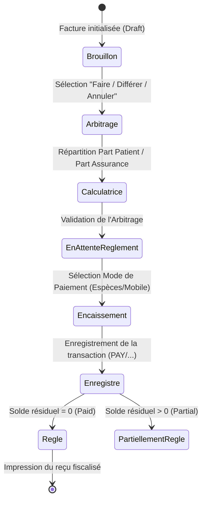

# 📚 Spécifications Techniques Complètes : Schéma de Base de Données, API FHIR & Modales UI (A à Z)

Ce document constitue la spécification technique et fonctionnelle de la plateforme d'Information Hospitalière (SIH). Il fournit la cartographie complète de l'architecture de données, des interfaces de communication standardisées FHIR R4 et de l'ergonomie des parcours utilisateurs clés.

---

## 💾 1. Schéma de la Base de Données Relationnelle (PostgreSQL)

La structure de données est optimisée pour garantir l'intégrité référentielle, le respect des règles comptables de double entrée (debit/credit) et l'exécution automatisée des transitions d'états à travers des procédures et déclencheurs (triggers) PL/pgSQL.

```sql
-- ==============================================================================
-- BASE DE DONNÉES SIH - SYSTÈME DE FACTURATION, COMPTABILITÉ & LABORATOIRE MÉDICAL
-- ==============================================================================

CREATE EXTENSION IF NOT EXISTS "uuid-ossp";

-- ------------------------------------------------------------------------------
-- 1. MODULE SÉCURITÉ, DROITS & UTILISATEURS
-- ------------------------------------------------------------------------------

CREATE TABLE res_groups (
    id SERIAL PRIMARY KEY,
    name VARCHAR(128) NOT NULL UNIQUE,
    description TEXT,
    created_at TIMESTAMP DEFAULT NOW()
);

CREATE TABLE res_users (
    id SERIAL PRIMARY KEY,
    login VARCHAR(128) NOT NULL UNIQUE,
    password_hash VARCHAR(255) NOT NULL,
    name VARCHAR(128) NOT NULL,
    email VARCHAR(255),
    active BOOLEAN DEFAULT TRUE,
    partner_id INTEGER,
    created_at TIMESTAMP DEFAULT NOW(),
    updated_at TIMESTAMP DEFAULT NOW()
);

CREATE TABLE res_groups_users_rel (
    user_id INTEGER REFERENCES res_users(id) ON DELETE CASCADE,
    group_id INTEGER REFERENCES res_groups(id) ON DELETE CASCADE,
    PRIMARY KEY (user_id, group_id)
);

-- ------------------------------------------------------------------------------
-- 2. CONTACTS, CLIENTS, ASSURANCES & PATIENTS (RES_PARTNER)
-- ------------------------------------------------------------------------------

CREATE TABLE res_country (
    id SERIAL PRIMARY KEY,
    name VARCHAR(128) NOT NULL,
    code VARCHAR(2) NOT NULL UNIQUE
);

CREATE TABLE res_currency (
    id SERIAL PRIMARY KEY,
    name VARCHAR(3) NOT NULL UNIQUE,
    symbol VARCHAR(10) NOT NULL,
    active BOOLEAN DEFAULT TRUE
);

CREATE TABLE res_partner (
    id SERIAL PRIMARY KEY,
    name VARCHAR(255) NOT NULL,
    is_company BOOLEAN DEFAULT FALSE,
    partner_type VARCHAR(64) NOT NULL DEFAULT 'patient', -- 'patient', 'doctor', 'insurance', 'vendor'
    ndm VARCHAR(64) UNIQUE,                             -- Numéro de Dossier Médical (Contrôle d'Unicité)
    gender CHAR(1) CHECK (gender IN ('M', 'F')),
    age INTEGER,
    birth_date DATE,
    email VARCHAR(255),
    phone VARCHAR(64),
    street TEXT,
    city VARCHAR(128),
    commune VARCHAR(128),
    vat VARCHAR(64),                                    -- Numéro de TVA
    active BOOLEAN DEFAULT TRUE,
    
    -- Rattachements Assurances
    insurance_id INTEGER REFERENCES res_partner(id) ON DELETE SET NULL,
    insurance_name VARCHAR(128),
    insurance_coverage_rate INTEGER CHECK (insurance_coverage_rate BETWEEN 0 AND 100),
    convention_code VARCHAR(64),
    
    -- Détails cliniques de base
    allergies TEXT,
    medical_antecedents TEXT,
    contact_person_name VARCHAR(128),
    contact_person_phone VARCHAR(64),
    
    created_at TIMESTAMP DEFAULT NOW(),
    updated_at TIMESTAMP DEFAULT NOW()
);

-- Index pour optimiser la recherche d'unicité et le ciblage des dossiers
CREATE INDEX idx_partner_ndm ON res_partner(ndm);
CREATE INDEX idx_partner_phone ON res_partner(phone);
CREATE INDEX idx_partner_type ON res_partner(partner_type);

-- ------------------------------------------------------------------------------
-- 3. UNITÉS DE MESURE & CATALOGUE PRODUITS/PRESTATIONS
-- ------------------------------------------------------------------------------

CREATE TABLE uom_uom (
    id SERIAL PRIMARY KEY,
    name VARCHAR(64) NOT NULL UNIQUE,
    factor DECIMAL(12,6) DEFAULT 1.0
);

CREATE TABLE product_template (
    id SERIAL PRIMARY KEY,
    name VARCHAR(255) NOT NULL,
    description TEXT,
    list_price DECIMAL(12,2) NOT NULL DEFAULT 0.00,
    uom_id INTEGER REFERENCES uom_uom(id) ON DELETE RESTRICT,
    currency_id INTEGER REFERENCES res_currency(id) ON DELETE RESTRICT,
    category_name VARCHAR(128) NOT NULL,                 -- 'Consultation', 'Analyse', 'Imagerie', 'Médicament'
    lab_tests JSONB,                                     -- Paramètres d'analyse si type 'Analyse'
    active BOOLEAN DEFAULT TRUE,
    created_at TIMESTAMP DEFAULT NOW(),
    updated_at TIMESTAMP DEFAULT NOW()
);

CREATE TABLE product_product (
    id SERIAL PRIMARY KEY,
    product_tmpl_id INTEGER NOT NULL REFERENCES product_template(id) ON DELETE CASCADE,
    default_code VARCHAR(128) UNIQUE,
    barcode VARCHAR(128) UNIQUE,
    active BOOLEAN DEFAULT TRUE,
    created_at TIMESTAMP DEFAULT NOW(),
    updated_at TIMESTAMP DEFAULT NOW()
);

-- ------------------------------------------------------------------------------
-- 4. STRUCTURE DE FACTURATION ET COMPTABILITÉ (DEBIT / CREDIT)
-- ------------------------------------------------------------------------------

CREATE TABLE account_tax (
    id SERIAL PRIMARY KEY,
    name VARCHAR(128) NOT NULL,
    amount DECIMAL(5,2) NOT NULL DEFAULT 0.00,
    type_tax_use VARCHAR(32) NOT NULL DEFAULT 'sale',   -- 'sale', 'purchase', 'none'
    active BOOLEAN DEFAULT TRUE,
    created_at TIMESTAMP DEFAULT NOW()
);

CREATE TABLE account_move (
    id SERIAL PRIMARY KEY,
    name VARCHAR(128) UNIQUE,                           -- N° de Facture fiscalisé (ex: FAC/2026/01/0002)
    ref VARCHAR(255),                                   -- Réf interne / N° ordonnance ou consultation
    move_type VARCHAR(64) NOT NULL,                     -- 'out_invoice' (client), 'in_invoice' (fournisseur)
    state VARCHAR(32) NOT NULL DEFAULT 'draft',         -- 'draft', 'posted', 'cancel'
    partner_id INTEGER NOT NULL REFERENCES res_partner(id) ON DELETE RESTRICT,
    
    -- Renseignements patients complémentaires au moment de l'émission
    patient_name VARCHAR(255),
    patient_age_y INTEGER,
    patient_phone VARCHAR(64),
    ndm VARCHAR(64),
    
    invoice_date DATE NOT NULL DEFAULT CURRENT_DATE,
    invoice_date_due DATE,
    date DATE NOT NULL DEFAULT CURRENT_DATE,
    currency_id INTEGER REFERENCES res_currency(id) ON DELETE RESTRICT,
    
    -- Montants financiers consolidés
    amount_untaxed DECIMAL(12,2) NOT NULL DEFAULT 0.00,
    amount_tax DECIMAL(12,2) NOT NULL DEFAULT 0.00,
    amount_total DECIMAL(12,2) NOT NULL DEFAULT 0.00,
    amount_residual DECIMAL(12,2) NOT NULL DEFAULT 0.00, -- Reste à payer (R10)
    
    -- Tiers-Payant Assurances
    insurance_name VARCHAR(128),
    insurance_coverage_rate INTEGER DEFAULT 0,
    amount_insurance_share DECIMAL(12,2) DEFAULT 0.00,
    amount_patient_share DECIMAL(12,2) DEFAULT 0.00,
    
    payment_state VARCHAR(32) NOT NULL DEFAULT 'not_paid', -- 'not_paid', 'partial', 'paid', 'reversed'
    invoice_user_id INTEGER REFERENCES res_users(id),
    created_at TIMESTAMP DEFAULT NOW(),
    updated_at TIMESTAMP DEFAULT NOW()
);

CREATE TABLE account_move_line (
    id SERIAL PRIMARY KEY,
    move_id INTEGER NOT NULL REFERENCES account_move(id) ON DELETE CASCADE,
    partner_id INTEGER REFERENCES res_partner(id) ON DELETE RESTRICT,
    product_id INTEGER REFERENCES product_product(id) ON DELETE RESTRICT,
    tax_ids INTEGER[],                                  -- Tableau des IDs de taxe appliquées
    name VARCHAR(255) NOT NULL,                         -- Libellé de l'acte ou médicament
    quantity DECIMAL(12,3) NOT NULL DEFAULT 1.000,
    price_unit DECIMAL(12,2) NOT NULL DEFAULT 0.00,
    discount DECIMAL(5,2) DEFAULT 0.00,                 -- Taux de réduction direct (R05)
    price_subtotal DECIMAL(12,2) NOT NULL DEFAULT 0.00, -- Montant HT après réduction
    price_total DECIMAL(12,2) NOT NULL DEFAULT 0.00,    -- Montant TTC après réduction et taxes
    
    -- Écritures comptables
    debit DECIMAL(12,2) NOT NULL DEFAULT 0.00,
    credit DECIMAL(12,2) NOT NULL DEFAULT 0.00,
    balance DECIMAL(12,2) NOT NULL DEFAULT 0.00,
    sequence INTEGER DEFAULT 10,
    created_at TIMESTAMP DEFAULT NOW()
);

-- Index de jointure rapide pour la comptabilité analytique
CREATE INDEX idx_line_move_id ON account_move_line(move_id);
CREATE INDEX idx_line_product_id ON account_move_line(product_id);

-- ------------------------------------------------------------------------------
-- 5. SESSIONS DE CAISSE & REGLEMENTS (TILL SESSIONS / PAYMENTS)
-- ------------------------------------------------------------------------------

CREATE TABLE till_session (
    id SERIAL PRIMARY KEY,
    name VARCHAR(128) NOT NULL UNIQUE,                  -- Code de session (ex: TILL-2026-09-15-01)
    cashier_id INTEGER NOT NULL REFERENCES res_users(id),
    cashier_name VARCHAR(128) NOT NULL,
    state VARCHAR(32) NOT NULL DEFAULT 'in_progress',   -- 'in_progress', 'closed', 'validated'
    opened_at TIMESTAMP NOT NULL DEFAULT NOW(),
    closed_at TIMESTAMP,
    
    -- Validation d'arrêté de caisse
    cashbox_start DECIMAL(12,2) NOT NULL DEFAULT 0.00,  -- Fond de caisse initial (R07)
    cashbox_end DECIMAL(12,2),                           -- Fond de caisse déclaré au recomptage physique (R10)
    total_payments DECIMAL(12,2) NOT NULL DEFAULT 0.00, -- Somme de tous les règlements perçus dans la session
    difference DECIMAL(12,2) DEFAULT 0.00,              -- Écart constaté : déclaré - (début + perçu) (R10)
    
    notes TEXT,
    created_at TIMESTAMP DEFAULT NOW()
);

CREATE TABLE account_payment (
    id SERIAL PRIMARY KEY,
    name VARCHAR(128) UNIQUE,                           -- N° de transaction unique (ex: PAY/2026/09/0048)
    move_id INTEGER REFERENCES account_move(id) ON DELETE SET NULL,
    partner_id INTEGER NOT NULL REFERENCES res_partner(id),
    till_session_id INTEGER REFERENCES till_session(id) ON DELETE SET NULL,
    
    amount DECIMAL(12,2) NOT NULL,
    payment_date DATE NOT NULL DEFAULT CURRENT_DATE,
    payment_method_code VARCHAR(64) NOT NULL,            -- 'cash', 'wave', 'orange_money', 'moov_money', 'card', 'check', 'transfer', 'insurance'
    payment_method_name VARCHAR(128) NOT NULL,
    
    -- Champs de transaction Mobile Money / Électronique
    transaction_reference VARCHAR(128),                 -- N° de transaction de l'opérateur (R08)
    fee_amount DECIMAL(12,2) DEFAULT 0.00,               -- Frais additionnels d'opérateur (Wave/OM = 1%)
    
    state VARCHAR(32) NOT NULL DEFAULT 'posted',        -- 'draft', 'posted', 'cancelled'
    created_at TIMESTAMP DEFAULT NOW()
);

-- Indexation pour l'audit et le calcul de solde en temps réel
CREATE INDEX idx_payment_session_id ON account_payment(till_session_id);
CREATE INDEX idx_payment_move_id ON account_payment(move_id);

-- ------------------------------------------------------------------------------
-- 6. WORKFLOWS CLINIQUES & PLATEAUX TECHNIQUES (FHIR R4 EXTENSIONS)
-- ------------------------------------------------------------------------------

-- 6.1. Consultations et DME
CREATE TABLE medical_consultation (
    id SERIAL PRIMARY KEY,
    consultation_number VARCHAR(64) UNIQUE,             -- N° unique de rencontre / consultation (Encounter)
    partner_id INTEGER NOT NULL REFERENCES res_partner(id),
    patient_name VARCHAR(255) NOT NULL,
    patient_ndm VARCHAR(64) NOT NULL,
    patient_gender CHAR(1),
    patient_age INTEGER,
    patient_phone VARCHAR(64),
    
    doctor_id INTEGER REFERENCES res_users(id),
    doctor_name VARCHAR(128),
    specialty VARCHAR(128),
    consultation_date TIMESTAMP DEFAULT NOW(),
    status VARCHAR(64) NOT NULL DEFAULT 'pending_payment', -- 'pending_payment', 'triage', 'in_progress', 'completed'
    
    -- Triage & Constantes (R04)
    chief_complaint TEXT,
    vitals JSONB DEFAULT '{}'::jsonb,                    -- BP, Température, Glycémie, Poids, etc.
    
    -- Diagnostics & Prescriptions
    diagnosis TEXT,
    diagnosis_code VARCHAR(32),                          -- Encodage CIM-10 (R01, R04)
    prescribed_items JSONB DEFAULT '[]'::jsonb,          -- Lignes de soins, ordonnance ou examens demandés
    
    invoice_id INTEGER REFERENCES account_move(id) ON DELETE SET NULL,
    created_at TIMESTAMP DEFAULT NOW(),
    updated_at TIMESTAMP DEFAULT NOW()
);

-- 6.2. Ordres d'examens (Laboratoire et Imagerie)
CREATE TABLE lab_exam_order (
    id SERIAL PRIMARY KEY,
    order_number VARCHAR(128) UNIQUE,                   -- N° de prescription médicale (ServiceRequest)
    partner_id INTEGER NOT NULL REFERENCES res_partner(id),
    partner_name VARCHAR(255) NOT NULL,
    department VARCHAR(128) NOT NULL,                   -- 'Biochimie', 'Hématologie', 'Immunologie', 'Radiologie'
    exam_names TEXT[] NOT NULL,                         -- Liste des examens demandés dans ce bon
    
    status VARCHAR(64) NOT NULL DEFAULT 'pending_sampling', -- 'pending_sampling', 'in_progress', 'results_entered', 'validated'
    prescriber_name VARCHAR(128),
    technician_name VARCHAR(128),
    validated_by_doctor VARCHAR(128),
    
    -- Paramètres détaillés et résultats
    parameters JSONB NOT NULL DEFAULT '[]'::jsonb,       -- [{name: 'Hémoglobine', value: '14.2', ref: '12-16', unit: 'g/dL', is_abnormal: false}]
    conclusion TEXT,
    
    created_at TIMESTAMP DEFAULT NOW(),
    validated_at TIMESTAMP,
    updated_at TIMESTAMP DEFAULT NOW()
);

-- ------------------------------------------------------------------------------
-- 7. JOURNAL D'AUDIT COMPLET (TRACABILITÉ R02)
-- ------------------------------------------------------------------------------

CREATE TABLE log_journal_audit (
    id_log SERIAL PRIMARY KEY,
    id_utilisateur INTEGER REFERENCES res_users(id) ON DELETE SET NULL,
    utilisateur_nom VARCHAR(128),
    action VARCHAR(128) NOT NULL,                       -- 'INITIALISATION', 'CONNEXION', 'EMISSION_FACTURE', 'ENCAISSEMENT_CAISSE'
    date TIMESTAMP DEFAULT NOW(),
    details TEXT NOT NULL,
    scenario_id VARCHAR(64),
    numero_dossier VARCHAR(64),
    id_patient INTEGER,
    patient_nom VARCHAR(255),
    statut VARCHAR(32) DEFAULT 'succes',                -- 'succes', 'alerte', 'bloque'
    metadata JSONB                                      -- Trace complète de l'objet modifié (R02)
);

CREATE INDEX idx_audit_date ON log_journal_audit(date);
CREATE INDEX idx_audit_ndm ON log_journal_audit(numero_dossier);

-- ==============================================================================
-- ⚙️ 2. TRIGGERS, PROCÉDURES ET TRANSITIONS EN CASCADE (PL/PGSQL)
-- ==============================================================================

-- 1. Automatisme de Transition : Saisie de règlement -> Mise à jour du solde de la facture
CREATE OR REPLACE FUNCTION fn_update_invoice_payment_state()
RETURNS TRIGGER AS $$
DECLARE
    v_total_paid DECIMAL(12,2);
    v_invoice_total DECIMAL(12,2);
    v_new_residual DECIMAL(12,2);
    v_new_payment_state VARCHAR(32);
BEGIN
    -- Calcul du total payé pour cette facture
    SELECT COALESCE(SUM(amount), 0.00) INTO v_total_paid
    FROM account_payment
    WHERE move_id = NEW.move_id AND state = 'posted';
    
    -- Récupération du total de la facture
    SELECT amount_total INTO v_invoice_total
    FROM account_move
    WHERE id = NEW.move_id;
    
    v_new_residual := v_invoice_total - v_total_paid;
    
    IF v_new_residual <= 0 THEN
        v_new_payment_state := 'paid';
        v_new_residual := 0.00;
    ELSIF v_new_residual < v_invoice_total THEN
        v_new_payment_state := 'partial';
    ELSE
        v_new_payment_state := 'not_paid';
    END IF;
    
    -- Mise à jour de la facture
    UPDATE account_move
    SET amount_residual = v_new_residual,
        payment_state = v_new_payment_state,
        updated_at = NOW()
    WHERE id = NEW.move_id;
    
    -- Insertion automatique d'un log d'audit
    INSERT INTO log_journal_audit (id_utilisateur, utilisateur_nom, action, details, id_patient, patient_nom, statut)
    SELECT NEW.till_session_id, 'Caisse Automatique', 'ENCAISSEMENT', 
           'Encaissement enregistré d''un montant de ' || NEW.amount || ' FCFA sur la facture ID ' || NEW.move_id,
           m.partner_id, m.patient_name, 'succes'
    FROM account_move m
    WHERE m.id = NEW.move_id;

    RETURN NEW;
END;
$$ LANGUAGE plpgsql;

CREATE TRIGGER trg_payment_after_insert
AFTER INSERT OR UPDATE OF state ON account_payment
FOR EACH ROW EXECUTE FUNCTION fn_update_invoice_payment_state();

-- ==============================================================================
-- 👁️ 3. VUES SÉCURISÉES DE SUIVI DU WORKFLOW GLOBAL
-- ==============================================================================

-- Vue d'arbitrage et de visibilité globale des parcours patients
CREATE OR REPLACE VIEW v_suivi_patient_workflow AS
SELECT 
    p.ndm,
    p.name AS patient_name,
    m.id AS invoice_id,
    m.name AS invoice_number,
    m.payment_state AS statut_paiement,
    m.amount_total,
    m.amount_residual,
    c.id AS consultation_id,
    c.status AS statut_consultation,
    c.doctor_name,
    l.id AS lab_order_id,
    l.department,
    l.status AS statut_labo,
    l.exam_names
FROM res_partner p
LEFT JOIN account_move m ON p.id = m.partner_id
LEFT JOIN medical_consultation c ON m.id = c.invoice_id
LEFT JOIN lab_exam_order l ON p.id = l.partner_id
WHERE p.partner_type = 'patient';
```

---

## 🌐 2. Spécification des Endpoints de l'API FHIR R4

La plateforme intègre des endpoints conformes au standard international d'interopérabilité médicale **HL7 FHIR R4**. Tous les objets de données échangés possèdent des structures de métadonnées et d'identifiants standardisées.

### 2.1. Cartographie des ressources FHIR et Tables correspondantes

| Ressource FHIR | Table PostgreSQL Source | Utilisation Fonctionnelle |
| :--- | :--- | :--- |
| `Patient` | `res_partner` | Profil d'identité du malade, NDM, contacts, garant de couverture. |
| `Encounter` | `medical_consultation` | Visite médicale, cabinet, constantes cliniques, motif d'admission. |
| `Observation` | `medical_consultation` (vitals) | Constantes vitales quantitatives (Tension, Température, Glycémie). |
| `Condition` | `medical_consultation` (diagnosis) | Diagnostic principal encodé en CIM-10. |
| `MedicationRequest`| Ordonnance clinique | Prescriptions pharmaceutiques, posologie, durée de prise. |
| `ServiceRequest` | `lab_exam_order` | Prescription d'actes de laboratoire ou d'imagerie technique. |
| `DiagnosticReport` | Rapport de résultats | Compte-rendu d'analyses validé ou rapport du radiologue. |
| `Invoice` | `account_move` | Facture globale d'admission, ticket modérateur, part d'assurance. |
| `PaymentReconciliation` | `account_payment` | Encaissement fiscalisé à la caisse, référence de paiement. |
| `AuditEvent` | `log_journal_audit` | Journal complet d'audit pour la traçabilité des accès et des actions. |
| `Practitioner` | `res_users` | Fiche du personnel soignant, médecin ou infirmier. |
| `Coverage` | `res_partner` (insurance) | Contrat de prise en charge et taux de couverture de l'assureur. |
| `Basic` | `till_session` | Session de caisse ouverte/clôturée pour l'arrêté de compte journalier. |

---

### 2.2. Spécifications détaillées des Payloads et Requêtes API

#### 1. Recherche de dossier Patient par identifiant (`GET /fhir/Patient?identifier={ndm}`)
* **Requête** : `GET /fhir/Patient?identifier=urn:oid:1.2.3.4.5.6.7.8.9|NDM-0048`
* **Content-Type** : `application/fhir+json`
* **Réponse JSON (Bundle de type searchset)** :
```json
{
  "resourceType": "Bundle",
  "type": "searchset",
  "total": 1,
  "entry": [
    {
      "fullUrl": "https://api.hopital.example/fhir/Patient/48",
      "resource": {
        "resourceType": "Patient",
        "id": "48",
        "active": true,
        "identifier": [
          {
            "use": "official",
            "system": "urn:oid:1.2.3.4.5.6.7.8.9",
            "value": "NDM-0048"
          }
        ],
        "name": [
          {
            "use": "official",
            "family": "Mohamed MANDE",
            "given": ["Mohamed"]
          }
        ],
        "gender": "male",
        "birthDate": "1986-05-15",
        "telecom": [
          {
            "system": "phone",
            "value": "+225 07 08 09 10 11",
            "use": "mobile"
          }
        ],
        "address": [
          {
            "use": "home",
            "line": ["Plateau, Résidence Jasmine"],
            "city": "Abidjan",
            "country": "CIV"
          }
        ]
      }
    }
  ]
}
```

---

#### 2. Récupération du dossier médical global d'un patient (`GET /fhir/Patient/{id}/$everything`)
Cet endpoint consolidé extrait l'intégralité du dossier du patient incluant son historique de consultation, diagnostics, constantes, examens techniques, prescriptions et factures associées.
* **Requête** : `GET /fhir/Patient/48/$everything`
* **Réponse JSON (Bundle d'historique consolidé)** :
```json
{
  "resourceType": "Bundle",
  "type": "searchset",
  "total": 6,
  "entry": [
    {
      "resourceType": "Patient",
      "id": "48",
      "name": [{ "family": "MANDE", "given": ["Mohamed"] }]
    },
    {
      "resourceType": "Encounter",
      "id": "cons-102",
      "status": "finished",
      "class": {
        "system": "http://terminology.hl7.org/CodeSystem/v3-ActCode",
        "code": "AMB"
      },
      "subject": { "reference": "Patient/48", "display": "Mohamed MANDE" },
      "period": { "start": "2026-09-15T09:30:00Z", "end": "2026-09-15T10:00:00Z" }
    },
    {
      "resourceType": "Condition",
      "id": "cond-102",
      "clinicalStatus": { "coding": [{ "code": "active" }] },
      "code": {
        "coding": [
          {
            "system": "http://hl7.org/fhir/sid/icd-10",
            "code": "A09",
            "display": "Gastro-entérite d'origine infectieuse suspectée"
          }
        ]
      },
      "subject": { "reference": "Patient/48" }
    },
    {
      "resourceType": "Observation",
      "id": "obs-bp-102",
      "status": "final",
      "category": [{ "coding": [{ "code": "vital-signs" }] }],
      "code": { "coding": [{ "code": "85354-9", "display": "Tension Artérielle" }] },
      "subject": { "reference": "Patient/48" },
      "component": [
        {
          "code": { "coding": [{ "code": "8480-6", "display": "Systolic" }] },
          "valueQuantity": { "value": 120, "unit": "mmHg" }
        },
        {
          "code": { "coding": [{ "code": "8462-4", "display": "Diastolic" }] },
          "valueQuantity": { "value": 80, "unit": "mmHg" }
        }
      ]
    },
    {
      "resourceType": "Invoice",
      "id": "inv-509",
      "status": "balanced",
      "subject": { "reference": "Patient/48" },
      "totalNet": { "value": 18500, "currency": "XOF" }
    }
  ]
}
```

---

#### 3. Transaction d'envoi et de synchronisation (`POST /fhir`)
Utilisé pour envoyer un lot d'écritures (Bundle de transaction) en un seul appel atomique.
* **Requête** : `POST /fhir`
* **Payload JSON** :
```json
{
  "resourceType": "Bundle",
  "type": "transaction",
  "entry": [
    {
      "fullUrl": "urn:uuid:patient-1",
      "resource": {
        "resourceType": "Patient",
        "name": [{ "family": "KOFFI", "given": ["Jean"] }],
        "gender": "male"
      },
      "request": {
        "method": "POST",
        "url": "Patient"
      }
    },
    {
      "fullUrl": "urn:uuid:encounter-1",
      "resource": {
        "resourceType": "Encounter",
        "status": "in-progress",
        "subject": { "reference": "urn:uuid:patient-1" }
      },
      "request": {
        "method": "POST",
        "url": "Encounter"
      }
    }
  ]
}
```

---

## 🖥️ 3. Spécifications des Modales UI Prioritaires

Les interfaces utilisateurs ont été modélisées et implémentées de façon à présenter un guidage clair, minimisant les erreurs de saisie tout en simplifiant le travail quotidien du personnel hospitalier.

### 3.1. Modale M3.1 : Paiement Caisse, Arbitrage & Tiers-Payeur

Cette interface centralise le traitement financier du patient. Elle est accessible à la caisse et gère l'arbitrage du panier de soins, le calcul des quotes-parts et l'encaissement direct.

#### 🎛️ Structure Visuelle & Composants
1. **En-tête Identitaire :**
   * Nom complet du patient, photo ou avatar, et NDM affiché en évidence.
   * Indicateur de prise en charge d'assurance (ex : **Assurance GNA - Taux : 80%**).
2. **Tableau d'Arbitrage des Lignes de Soins (R09) :**
   * Liste des actes prescrits (ex : NFS, Urée, Glycémie, Consultation Médecin).
   * **Sélecteurs d'action par ligne :**
     * **Faire (Confirmé) :** Inclure la ligne dans la facture active.
     * **Différer (Postponed) :** Conserver la ligne dans le dossier clinique pour un règlement ultérieur.
     * **Annuler (Cancelled) :** Archiver et retirer définitivement la ligne du dossier.
3. **Calculateur de Répartition Financière :**
   * Sous-total Brut cumulé des lignes "A faire".
   * Déduction de la part Tiers-Payeur Assurance calculée dynamiquement (ex : 80% du total).
   * Montant net du Ticket Modérateur à la charge du patient (Patient Share).
4. **Sélecteur de Mode de Règlement (R08) :**
   * Boutons illustrés avec icônes (Espèces, Wave, Orange Money, Moov Money, Carte Bancaire).
   * **Panneau Mobile Money Intégré :** Saisie du numéro de téléphone de l'expéditeur et calcul automatique des frais d'opérateur de 1% (Wave/OM). Saisie de la référence de transaction de l'opérateur (requis pour valider le reçu).
5. **Zone de Validation & Impression :**
   * Bouton d'encaissement sécurisé et impression immédiate du reçu fiscalisé conforme.

#### 🔄 Diagramme de Transitions d'États (Caisse & Facturation)



---

### 3.2. Modale M3.2 : Ouverture & Clôture de Session Caisse

Cette modale sécurise les flux de trésorerie en imposant une déclaration stricte du fond de caisse à l'ouverture, et un décompte de billetage physique au moment de la fermeture de la session (R07, R10).

#### 🎛️ Structure Visuelle & Composants
1. **Écran d'Ouverture :**
   * Identifiant de la caisse (ex : Guichet Caisse Principal 1).
   * Date et heure courantes de prise de poste.
   * Champ de saisie du **Fond de Caisse Initial** (par défaut : 50 000 FCFA).
   * Note d'observation de l'état de la caisse.
2. **Écran de Clôture avec Panneau de Billetage Physique :**
   * Affichage du solde théorique calculé par le système (Début + Somme des encaissements enregistrés).
   * **Calculateur de Billetage de Monnaie :**
     * Tableau des dénominations de billets (10 000, 5 000, 2 000, 1 000, 500) et pièces (200, 100, 50, 25).
     * Saisie des quantités physiques recomptées par le caissier.
     * Sommation automatique en temps réel des valeurs monétaires saisies.
3. **Analyse des Écarts de Trésorerie (R10) :**
   * Comparateur de solde physique calculé par le billetage vs solde système théorique.
   * **Affichage de l'Écart :**
     * Vert : Solde parfait (Écart = 0 FCFA).
     * Rouge : Déficit ou Excédent constaté, forçant la saisie d'un commentaire d'explication.
4. **Génération du Bordereau Z (Synthèse journalière) :**
   * Impression thermique ou PDF détaillant le résumé des ventes par catégorie de soins et les modes de paiement.

---

### 3.3. Modale M4.2 : Saisie & Validation des Résultats de Laboratoire

Conçue pour le plateau technique, cette modale s'adapte au rôle de l'utilisateur pour séparer strictement l'étape de saisie des valeurs par le technicien, et l'étape de validation médicale par le biologiste agréé (R06).

#### 🎛️ Structure Visuelle & Composants
1. **En-tête Clinique :**
   * N° d'échantillon barcodé (SID) et NDM du patient.
   * Renseignement de la provenance (Service prescripteur, Chambre, Cabinet).
2. **Formulaire de Saisie des Paramètres Biologiques :**
   * Tableau dynamique listant les examens prescrits.
   * Champs d'entrée des valeurs mesurées, configurés pour accepter les décimaux.
   * Affichage des **intervalles de référence normaux** (ex : 12.0 - 16.0 g/dL).
   * **Détecteur d'Abnormalité Automatique :** Comparateur automatique qui met en relief (fond rouge / police blanche) les valeurs en dehors des limites de référence.
3. **Zone de Commentaire & Conclusion :**
   * Zone de texte riche pour saisir l'interprétation biologique ou l'avis de pathologie.
4. **Contrôle d'Habilitation d'Habilitations & Validation :**
   * **Mode Saisie (Technicien) :** Permet d'enregistrer les valeurs brutes. Le statut passe à `results_entered`. Le bouton "Valider Médicalement" est grisé.
   * **Mode Validation (Biologiste) :** Permet de relire, corriger, et cliquer sur "Validation Biologique Définitive". Cette action verrouille définitivement les données (R06) et déclenche la transmission des résultats sur le DME du patient en temps réel.

#### 🔄 Parcours du Workflow de Laboratoire

```mermaid
flowchart LR
    A[Facture payée en caisse] --> B[Échantillon généré]
    B --> C[Prélèvement sanguin effectué]
    C --> D[Génération du Code-barres]
    D --> E[Saisie des valeurs par le technicien]
    E --> F[Statut : Saisi pour relecture]
    F --> G[Validation finale par le Biologiste]
    G --> H[Verrouillage complet des données]
    H --> I[Mise à jour en temps réel sur le DME]
```



---

## 🔒 4. Matrice de Sécurité & Gestion des Rôles (RBAC)

La plateforme applique des restrictions strictes basées sur les habilitations de l'utilisateur afin de préserver la confidentialité des données et d'empêcher les détournements financiers.

| Profil Habilité | Rôles & Autorisations d'Écran | Restrictions critiques |
| :--- | :--- | :--- |
| **Administrateur Universel** | Accès absolu à tous les modules, configurations et suppression de données. | Aucun. |
| **Superviseur de Caisse** | Validation des arrêtés de caisse, visualisation des rapports consolidés, vérification des écarts. | Interdiction de percevoir directement des paiements de patients. |
| **Caissier Principal** | Ouverture/clôture de till personnelle, enregistrement des paiements, encaissement espèces et mobile. | Interdiction de modifier les tarifs de soins ou de supprimer des factures. |
| **Technicien Laboratoire** | Saisie des résultats d'analyses techniques, gestion des prélèvements sanguins. | Interdiction de valider définitivement les résultats d'analyses (R06). |
| **Biologiste Médical** | Saisie des résultats, conclusion et validation médicale définitive de tous les examens. | Interdiction de modifier les tarifs ou d'encaisser des règlements. |
| **Médecin Praticien** | Ouverture de consultations, examen patient, anamnèse, saisie de diagnostics CIM-10, prescriptions de soins. | Interdiction d'accéder aux écrans de caisse ou d'arrêté de coffre. |
| **Infirmier Major** | Triage patient, prise des constantes initiales, administration de soins guidés, double-contrôle sécurisé. | Interdiction de prescrire ou de valider définitivement des examens biologiques. |
